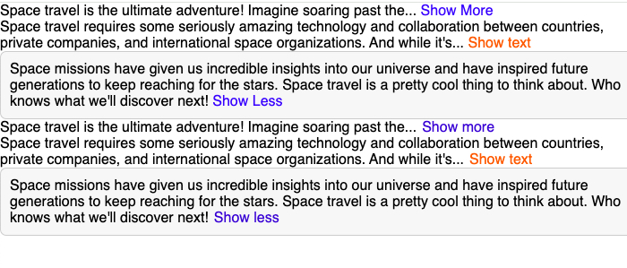

# Text Expander Component

## Table of contents

- [Overview](#overview)
  - [The challenge](#the-challenge)
  - [Screenshot](#screenshot)
  - [Links](#links)
- [My process](#my-process)
  - [Built with](#built-with)
  - [What I learned](#what-i-learned)
  - [Continued development](#continued-development)
- [Author](#author)

## Overview

### The challenge

Users should be able to:

- View the optimal layout for the app depending on their device's screen size
- Expand and compress text.

### Screenshot

### Links

- Live Site URL: [View](https://textexpandercomponent.netlify.app/)

## My process

- This React code implements two components: `TextExpander` and `TeachersTextExpander`, both designed to toggle between showing truncated and full text.
- Each component receives text as children and provides an option to either display a limited number of words or reveal the full content.
- In `TextExpander`, the `getTextFromChildren` function recursively extracts the text from nested elements.
- Based on the `collapsedNumWords` prop, the text is either partially displayed or fully revealed when the user clicks a button, which toggles the expanded state.
- The button's text and style are customizable through props like `expandButtonText`, `collapseButtonText`, and `buttonColor`.
- The `TeachersTextExpander` works similarly but uses simpler logic to truncate the text and manage the button's visibility.
- It defaults to showing a limited number of words and expands upon user interaction.
- Both components offer flexibility and customization for different use cases, allowing users to control how much text is shown and customize the appearance and behavior of the button that triggers the expansion.

### Built with

- Semantic HTML5 markup
- CSS custom properties
- Mobile-Responsive Design
- JavaScript - Scripting language
- [React](https://reactjs.org/) - JS library

### What I learned

This was a class project to test my knowledge on props.

### Continued development

maybe use later

## Author

- Website - [Cameron Howze](https://camkol.github.io/)
- Frontend Mentor - [@camkol](https://www.frontendmentor.io/profile/camkol)
- GitHub- [@camkol](https://github.com/camkol)
- LinkedIn - [@cameron-howze](https://www.linkedin.com/in/cameron-howze-28a646109/)
- E-Mail - [cameronhowze4@outlook.com](mailto:cameronhowze4@outlook.com)
